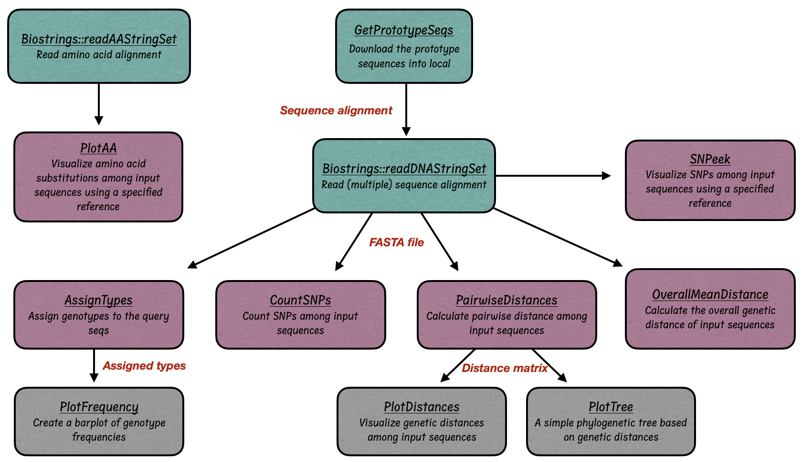

# rhinotypeR

<!-- badges: start -->
<!-- badges: end -->

               /**       /**                       /**                                   /*** *** 
              | **      |**/                      | **                                  | **__  **
      /****** | *******  /** /*******   /******  /******   /**   /**  /******   /****** | **  \ **
     /**__  **| **__  **| **| **__  ** /**__  **|_  **_/  | **  | ** /**__  ** /**__  **| *******/
    | **  \__/| **  \ **| **| **  \ **| **  \ **  | **    | **  | **| **  \ **| ********| **__  **
    | **      | **  | **| **| **  | **| **  | **  | ** /**| **  | **| **  | **| **_____/| **  \ **
    | **      | **  | **| **| **  | **|  ******/  |  *****/|  *******/| ********|  *******/| **  | 
    |__/      |__/  |__/|__/|__/  |__/ \______/    \___/   \____  **| **____/  \_______/|__/  |__/
                                                           /**  | **| **                          
                                                          |  ******/| **                          
                                                           \______/ |__/                          

## Table of Contents

1.  [Background](#Background)
2.  [Test-Data](#Test-Data)
3.  [Workflow](#Workflow)
4.  [Package](#Package)
5.  [Contributors](#Contributors/%20Citation)

## Background

Rhinoviruses (RV), common respiratory pathogens, are positive-sense,
single-stranded RNA viruses characterized by a high antigenic diversity
and mutation rate. These viruses are classified into 169 types across
three species: RV-A, RV-B, and RV-C. Genotype assignment, a critical
aspect of RV research, is based on pairwise genetic distances and
phylogenetic clustering with prototype strains, a process currently
executed manually and laboriously. We address this by presenting
rhinotypeR, an R package that streamlines the classification of
rhinoviruses ensuring rapid, reproducible results.

## Test-Data

The project utilizes VP4/2 sequences available in the public domain from
GenBank and reference prototype strains from www.picornaviridae.com The
input datasets (target, reference and prototype) are fasta files. Here’s
an example of a FASTA file:

## Workflow

RhinotypeR workflow. The user downloads prototype strains using
`getPrototypeSeqs()` function, combines these with their newly generated
VP4/2 sequences, aligns and manually curates the alignment. The user
then reads the curated alignment into R using
`Biostrings::readDNAStringSet()` function. The DNAStringSet object can
then be used to run all the second-level functions, including
`assignTypes()` which assigns the sequences into genotypes, filters out
the prototype sequences and returns the genotype assignment of the new
sequences. This output can be used to visualise the frequency of
assigned genotypes. The distance matrix object, an output of
`pairwiseDistance()` function, can be used to create a phylogenetic tree
or a heatmap to visualize genetic relatedness of sequences.

## Package

Our package aims to streamline RV genotype assignment, facilitating
genomic scientists in efficiently genotyping RV infections.

### Installation

You can install rhinotypeR from BioConductor using

    if (!require("BiocManager", quietly = TRUE))
        install.packages("BiocManager")

    BiocManager::install("rhinotypeR")

You can also install the development version of rhinotypeR from GitHub
with:

    devtools::install_github("omicscodeathon/rhinotypeR")

##### Load Library

    library("rhinotypeR")

## Functions

The package encompasses functions to compute genetic distances, perform
phylogenetic clustering, and compare sequences against RV prototype
strains. These functionalities are designed to be user-friendly and
adaptable to various research needs.

The package (summarized in Table 1) does the following: - Assigns
genotypes to query sequences - Computes for pairwise distance among
query sequences - Calculates pairwise distance between query and
prototype sequences - Calculates overall genetic distance of query
sequences

#### Table 1. A summary of the functions

<table>
<colgroup>
<col style="width: 15%" />
<col style="width: 35%" />
<col style="width: 23%" />
<col style="width: 25%" />
</colgroup>
<thead>
<tr class="header">
<th>Function</th>
<th>Role</th>
<th>Input</th>
<th>Output</th>
</tr>
</thead>
<tbody>
<tr class="odd">
<td><code>getPrototypeSeqs()</code></td>
<td>Downloads rhinovirus prototype strains into a local directory. These
sequences should be combined with and aligned alongside newly generated
sequences before being imported into R for genotype assignment</td>
<td>Destination path</td>
<td>RV prototypes are downloaded into the local machine</td>
</tr>
<tr class="even">
<td><code>SNPeek()</code></td>
<td>Visualizes single nucleotide polymorphisms (SNPs) relative to a
specified reference sequence. To specify the reference, move it to the
bottom of the alignment. Substitutions are color-coded by nucleotide: A
= green, T = red, C = blue, G = yellow</td>
<td>fasta file</td>
<td>A plot highlighting SNPs per sequence</td>
</tr>
<tr class="odd">
<td><code>plotAA()</code></td>
<td>Plots amino acid substitutions with a specified sequence as the
reference. The input is an amino acid fasta file (translated DNA
sequences). To specify the reference sequence, move it to the bottom of
the alignment. Changes are coloured by the class of amino acid: Red =
Positively charged, Blue = Negatively charged, Green = Polar, Yellow =
Non-polar</td>
<td>Amino acid fasta file</td>
<td>A plot highlighting amino acid substitutions per sequence</td>
</tr>
<tr class="even">
<td><code>assignTypes()</code></td>
<td>Rapidly assigns genotypes to input sequences. The input fasta file
should include the prototype strains, which can be downloaded using
getPrototypeSeqs()</td>
<td>fasta file</td>
<td>CSV file with three columns: sequence header, assigned type, and
genetic distance</td>
</tr>
<tr class="odd">
<td><code>pairwiseDistances()</code></td>
<td>Estimates pairwise distances across input sequences using a
specified evolutionary model</td>
<td>fasta file</td>
<td>A dense distance matrix</td>
</tr>
<tr class="even">
<td><code>overallMeanDistance()</code></td>
<td>Estimates the overall mean distance of input sequences</td>
<td>fasta file</td>
<td>A single numeric value</td>
</tr>
<tr class="odd">
<td><code>countSNPs()</code></td>
<td>Counts single nucleotide polymorphisms across input sequences</td>
<td>fasta file</td>
<td>A dense matrix</td>
</tr>
<tr class="even">
<td><code>plotFrequency()</code></td>
<td>Plots the frequency of assigned genotypes. This function uses the
output of assignTypes() as input</td>
<td>output from assignTypes</td>
<td>Barplot</td>
</tr>
<tr class="odd">
<td><code>plotDistances()</code></td>
<td>Visualizes pairwise genetic distances in a heatmap. This function
uses the output of pairwiseDistances() as input</td>
<td>distance matrix from prototype distance function</td>
<td>Heatmap</td>
</tr>
<tr class="even">
<td><code>plotTree()</code></td>
<td>Plots a simple phylogenetic tree using the genetic distances
estimated by pairwiseDistances()</td>
<td>output from pairwise distances</td>
<td>A simple phylogenetic tree</td>
</tr>
</tbody>
</table>

## Contributors/ Citation

Martha M. Luka1,#, Ruth Nanjala2, Wafaa M. Rashed3,4, Winfred Gatua5,6,
Olaitan I. Awe7 \# <m.luka.1@research.gla.ac.uk>

Authors’ Affiliation

1.  School of Biodiversity, One Health and Veterinary Medicine,
    University of Glasgow, Glasgow, G12 8QQ, UK.
2.  Kennedy Institute of Rheumatology, Nuttfield Department of
    Orthopaedics, Rheumatology and Musculoskeletal Sciences, University
    of Oxford, UK.
3.  Pharmacy Practice Department, Faculty of Pharmacy, Ahram Canadian
    University, Egypt.
4.  Computational Systems Biology Laboratory, USP, Brazil.
5.  MRC Integrative Epidemiology Unit, University of Bristol, UK.  
6.  Population Health Sciences, Bristol Medical School, UK.
7.  African Society for Bioinformatics and Computational Biology, Cape
    Town, South Africa.
